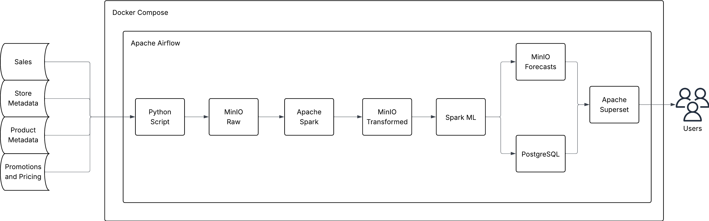
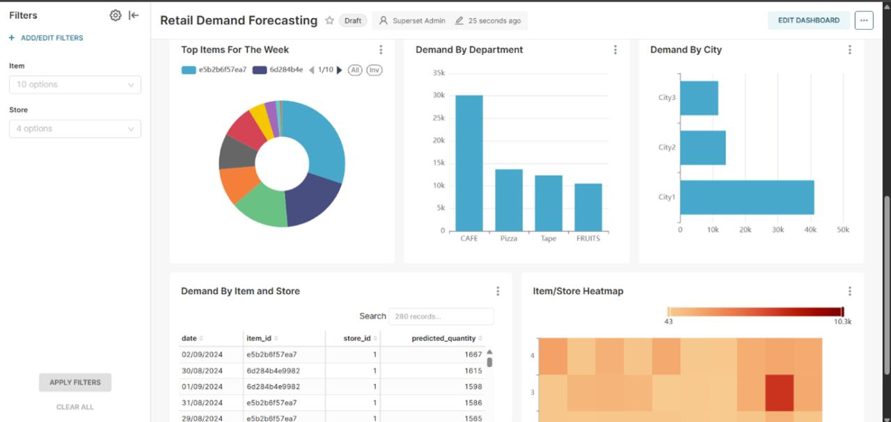

# Retail Demand Forecasting Pipeline

An end-to-end Big Data engineering pipeline designed to forecast retail demand. This project handles data ingestion, transformation, model training, and daily predictions.

## 🏗️ Architecture

The pipeline is built on a architecture designed to simulate a production environment:

### Proof of Concept (PoC) Architecture


### Data Flow
1.  **Ingestion**: Raw data is split and ingested into **MinIO** (S3-compatible object storage) into a `raw` zone.
2.  **Transformation**: **Apache Spark** processes the raw data, performing feature engineering and data cleaning, then stores it in the `transformed` zone.
3.  **Model Training**: A machine learning model is trained on the historical data using Spark and Scikit-Learn.
4.  **Orchestration**: **Apache Airflow** manages the workflow, scheduling daily ingestion, transformation, and prediction tasks.
5.  **Serving**: Daily forecasts are generated and loaded into a **PostgreSQL** database.
6.  **Visualization**: **Apache Superset** provides interactive dashboards for monitoring demand and forecast accuracy.

## 🛠️ Tech Stack

*   **Orchestration**: Apache Airflow 2.10.5
*   **Data Processing**: Apache Spark 4.0.0 (PySpark)
*   **Object Storage**: MinIO
*   **Database**: PostgreSQL 13 (for Airflow metadata, Superset, and Forecasts)
*   **Visualization**: Apache Superset
*   **Containerization**: Docker & Docker Compose
*   **Languages**: Python 3.12, SQL

## 📂 Project Structure

```text
.
├── dags/                       # Airflow DAGs and processing scripts
│   ├── demand_forecast_pipeline_dag.py  # Main pipeline definition
│   ├── split_data.py           # Local data partitioning script
│   ├── initial_ingest.py       # Initial MinIO ingestion
│   ├── ingest_daily_slice.py   # Daily simulation ingestion
│   ├── transform_data.py       # Spark Feature Engineering
│   ├── train_model.py          # Model Training script
│   ├── predict_daily.py        # Forecasting and Postgres loading
├── initdb/                     # SQL scripts for database initialization
├── data/                       # [Required] Local data directory (ignored by git)
│   └── raw/                    # Place raw CSVs here
├── Dockerfile                  # Custom Airflow image with Spark/Java
├── docker-compose.yaml         # Full stack deployment
├── requirements.txt            # Python dependencies
└── poc_architecture.jpeg       # Implemented architecture
```

## 🚀 Getting Started

### Prerequisites
*   Docker and Docker Compose installed.

### 1. Data Preparation
The pipeline expects raw data in a `./data/raw/` directory. Ensure the following files are present:
*   `sales.csv`: Historical sales transactions.
*   `catalog.csv`: Product metadata.
*   `price_history.csv`: Historical pricing.
*   `markdowns.csv`, `discounts_history.csv`, `actual_matrix.csv`, `stores.csv`.

> [!NOTE]
> The current PoC is configured to filter and process a subset of **10 specific item IDs** defined in `dags/split_data.py` to optimize for local resources.

### 2. Deployment

1.  **Clone the repository**:
    ```bash
    git clone https://github.com/amitHarwani/retail_demand_forecasting_big_data_engineering.git
    cd retail_demand_forecasting_big_data_engineering
    ```

2.  **Build and Start the services**:
    ```bash
    docker-compose up -d --build
    ```
    This will launch:
    *   **MinIO**
    *   **Airflow**
    *   **Superset**

3.  **Initialization**:
    Wait a few minutes for `superset-init` and `airflow-init` to complete. They will handle user creation.

## ⚙️ Running the Pipeline

Access the Airflow UI at `http://localhost:8080` and run the DAGs in order:

### 1. `demand_forecast_initial_training`
**Run this first.** It partitions the raw data, uploads it to MinIO, runs the initial Spark transformation, and trains the forecasting model.

### 2. `demand_forecast_pipeline`
**Run this to simulate daily operations.** It ingests a new "day" of data, performs incremental transformation, generates a 7-day forecast, and loads it into PostgreSQL for visualization.

## 📊 Visualization



---
*Created as a Proof of Concept for Retail Demand Forecasting using Big Data Engineering best practices.*
